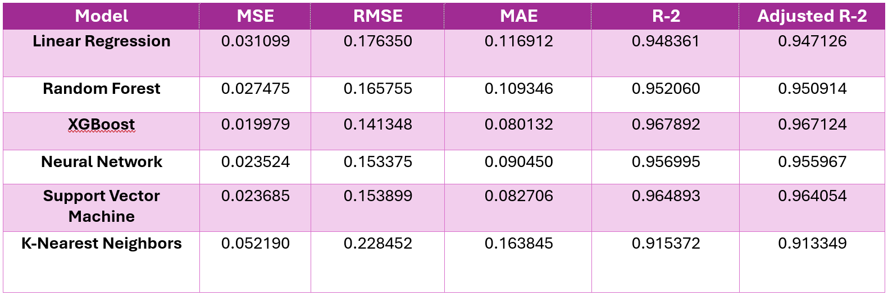

# 🚀 Machine Learning Projects Repository

This repository contains a collection of **Machine Learning projects**, covering various domains such as **fraud detection, financial sentiment analysis, and more**. Each project is self-contained, demonstrating a specific ML/AI concept with clear implementations and results.

---

## 🛡️ Credit Card Fraud Detection

#### 📌 Overview

This project implements a **credit card fraud detection system** using **Support Vector Machines (SVM)** and **Principal Component Analysis (PCA)**. The model analyzes financial transactions to classify them as **fraudulent or authentic**, helping mitigate risks in digital financial systems.

#### 🛠️ Technologies Used

- **Machine Learning:** SVM, PCA
- **Libraries:** Scikit-learn, NumPy, Pandas, Matplotlib
- **Dataset:** Financial transaction records with fraud labels

#### 🔑 Key Features

- **Dimensionality Reduction:** PCA improves model efficiency.
- **Fraud Classification:** SVM handles high-dimensional transaction data.
- **Data Preprocessing:** Balanced dataset using oversampling for better fraud detection.

#### 📊 Hierarchical Fraud Classification

Fraudsters are categorized based on their corporate and community level roles.

#### 🔍 Principal Component Analysis (PCA)

To reduce dimensionality, PCA was applied, and the scree plot below shows the eigenvalues of each principal component.

#### ⚡ ML Pipeline

Our pipeline standardizes the data, applies PCA for feature selection, and then uses an **SVM classifier** to predict fraudulent transactions.

#### 🚀 Results

- **Model Accuracy:** **72.63% (test), 72.93% (train)**
- **Fraudulent Transactions Identified:** Mainly found in **Transfer & Cash-Out transactions**.
- **Dimensionality Reduction Success:** PCA helped optimize performance while retaining fraud detection accuracy.

🔗 **[Full Report & Code](fraud-detection/)**

---

## 💰 Financial News Sentiment Analysis Application

#### 📌 Overview

This project implements a **news sentiment analysis application** using the **DistilRoBERTa model fine-tuned for financial news sentiment analysis**, accessible via the **Hugging Face API**. The model classifies financial texts, such as market reports and news articles, into different sentiment categories to help users analyze the market sentiment.

#### 🛠️ Technologies Used

- **Machine Learning:** DistilRoBERTa (fine-tuned for financial sentiment analysis)
- **Libraries:** Hugging Face Transformers, Flask, PostgreSQL
- **Deployment:** Flask API, hosted on Heroku

#### 🔑 Key Features

- **Real-Time Sentiment Analysis:** Uses Hugging Face API for instant results.
- **Financial-Specific Model:** Trained on financial news to improve accuracy in economic contexts.
- **Web Application Interface:** Built using Flask, allowing users to input text and receive real-time analysis.

#### 🚀 How It Works

1. **User inputs financial text** (e.g., a market report or company earnings statement).
2. **The text is sent to the Hugging Face API**, which classifies sentiment as **positive, negative, or neutral**.
3. **The results are displayed** in a user-friendly interface.

#### 📈 Model Used

The **pretrained model** used for this task:
🔗 **[DistilRoBERTa fine-tuned for financial sentiment analysis](https://huggingface.co/mrm8488/distilroberta-finetuned-financial-news-sentiment-analysis)**

🔗 **[Full Code & Implementation](news-sentiment-analysis/)**

---

## 💼 Credit Score Prediction

#### 📌 Overview

This project develops a **credit scoring model** using various machine learning techniques to predict an individual's creditworthiness based on financial and business data. The model leverages **XGBoost, Random Forest, Neural Networks, and other algorithms** to enhance prediction accuracy.

#### 🛠️ Technologies Used

- **Machine Learning:** XGBoost, Random Forest, Neural Networks, SVM, KNN, Linear Regression
- **Libraries:** Scikit-learn, Pandas, NumPy, Matplotlib
- **Data Processing:** One-hot encoding, Label Encoding, StandardScaler for normalization

#### 🔑 Key Features

- **Automated Data Processing:** Handles missing values, categorical data encoding, and numerical transformations.
- **Multiple Model Evaluation:** Compares various models using **MSE, RMSE, MAE, R-squared, and Adjusted R-squared**.
- **Optimal Model Selection:** Identifies the most accurate model for credit score prediction.

#### 📈 Results

- **Top Performing Model:** **XGBoost** with the highest **R-squared score of 96.78%**.
- **Feature Normalization Success:** StandardScaler helped improve model convergence and accuracy.
- **Regression Task Optimized:** Removed inappropriate evaluation metrics (e.g., F1-Score) since the task is continuous rather than classification-based.

Below is a comparison table showing the evaluation metrics for different models tested in this project:

The table highlights the accuracy of different machine learning models used for credit scoring. **XGBoost** outperforms other models with the **lowest Mean Squared Error (MSE) and Root Mean Squared Error (RMSE)**, indicating its high precision. Random Forest and Neural Network models also show strong performance. On the other hand, K-Nearest Neighbors (KNN) has the **highest error rates**, making it the least suitable for this task.

🔗 **[Full Report & Code](credit-scoring/)**

---
